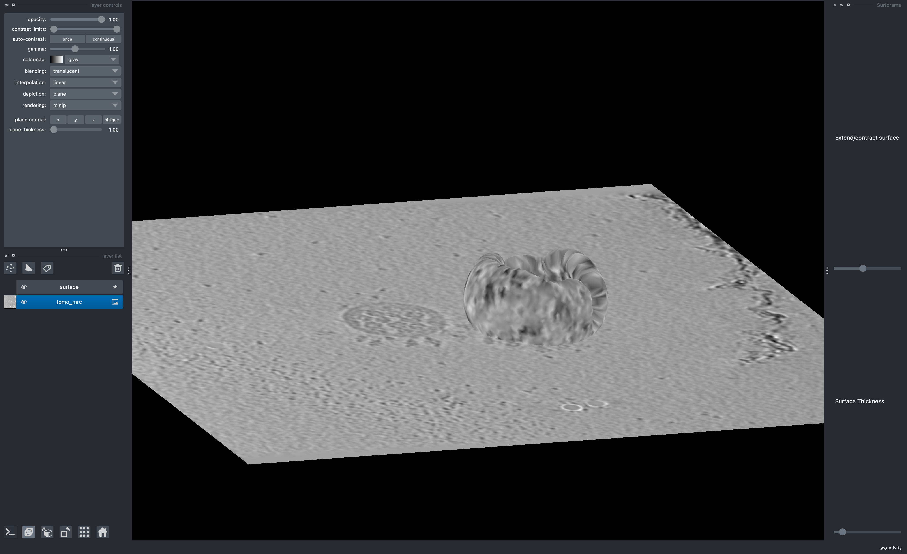

# surforama
a napari-based tool for using surfaces to explore volumetric data in napari

inspired by [membranorama](https://github.com/dtegunov/membranorama)



## installation
`surforama` requires the napari viewer. If you would like to install napari and surforama together in one line, you can use the following command:

```bash
pip install "surforama[napari]"
```


If you already have napari installed, you can directly install surforama in the same environment:

```bash
pip install surforama
```

## usage
### launch with demo data
If you'd like to test surforama out, you can launch surforama with demo data:

```bash
surforama --demo
```

### launch without data
You can launch surforama using the command line interface. After you have installed surforama, you can launch it with the following command in your terminal:

```bash
surforama
```
After surforama launches, you can load your image and mesh into napari and get surfing!

### launch with data
If you have an MRC-formatted tomogram and an obj-formatted mesh, you can launch using the following command:

```bash
surforama --image-path /path/to/image.mrc --mesh-path /path/to/mesh.obj
```

## developer installation

If you would like to make changes to the surforama source code, you can install surformama with the developer tools as follows:

```bash
cd /path/to/your/surforama/source/code/folder
pip install -e ".[dev]"
```
We use pre-commit to keep the code tidy. Install the pre-commit hooks to activate the checks:

```bash
pre-commit install
```
