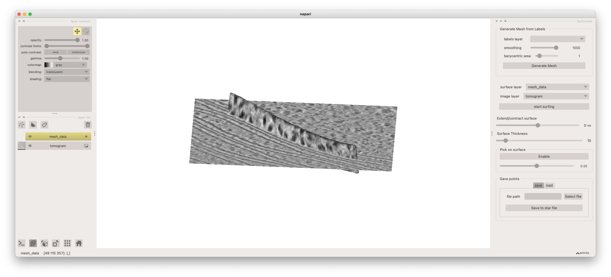
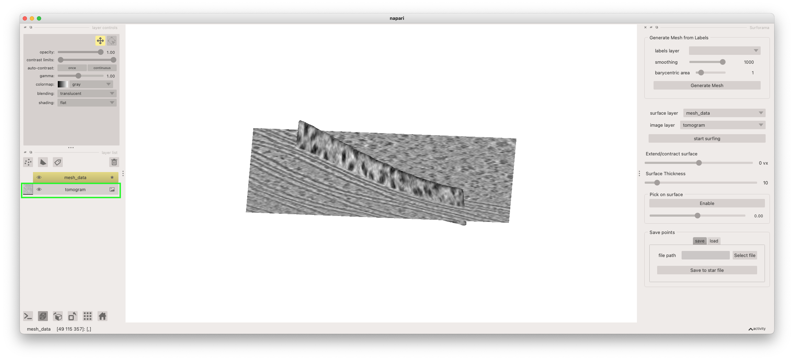
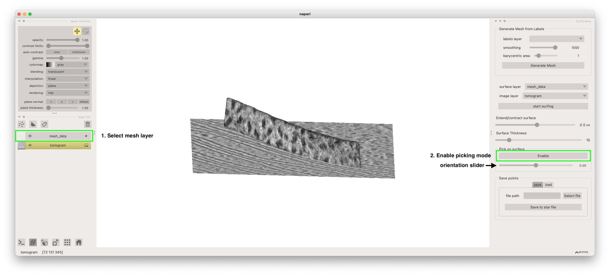
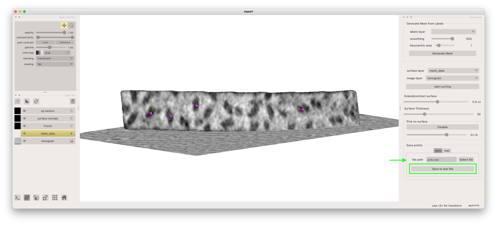

# Getting started with surforama

This short tutorial explains how to annotate particles on your first membrane with `Surforama`. If you haven't already installed `Surforama`, please see our [installation instructions](installation.md). First, open your terminal and activate the Python environment with `Surforma` installed. Then launch `Surforama` with the included sample data with the following command

```bash
surforama --demo
```

This will launch the napari viewer with the Surforama plugins and sample data open. Note that the first time you launch napari may take a bit of extra time. The sample data is a tomogram and of a Chal chloroplast and a mesh of a segment of membrane. In this demo, we will annotate the photosystem II densities on the surface of this membrane. The tomogram is loaded as an image layer and the mesh of the membrane surface is loaded as a surface layer.

{ align=center }

The tomogram is rendered as a 2D slice. You can move the position of the slice being rendered by first selecting the image layer (named "tomogram") from the layer list and then holding the "shift" key while clicking and dragging on the plane with your left mouse button. You can rotate the view by clicking and dragging in the canvas and zoom by using the scroll wheel on your mouse.

{ align=center }


We can now initialize the picking mode that will allow you to annotate particle locations and orientations on the membrane. First, select the mesh layer from the layer list (named "mesh_data"). Then click the "start picking" button.



With the picking mode activated, we can now annotate particles on the membrane surface. We can select the centroid of a particle by clicking on it. This will place the particle. We can then set the orientation by adjusting the orientation slider underneath the "enable/disable" picking button (denoted in the screenshot above). The orientation of the particle is indicated by orange arrow point away from the centroid marker.


Finally, you can output your annotated particles as a Relion-formatted Star file. To do so, enter the file path in the "Save" table of the "Save points" widget and click the "Save to star file" button.

{ align=center }
