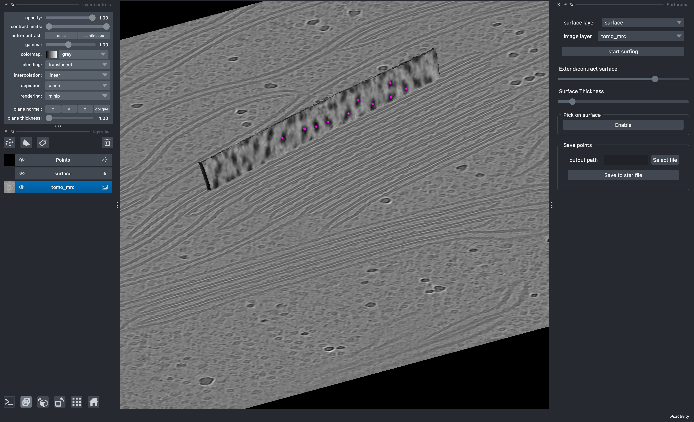

# Surforama
a napari-based tool for using surfaces to explore volumetric data. Using `Surforama` you can visualize densities on a membrane surface, annotate particle locations and orientations, and analyze the picked particles.

inspired by [membranorama](https://github.com/dtegunov/membranorama)

If you would like to give `Surforama` a try, check out our [Getting Started](getting_started.md) tutorial.
