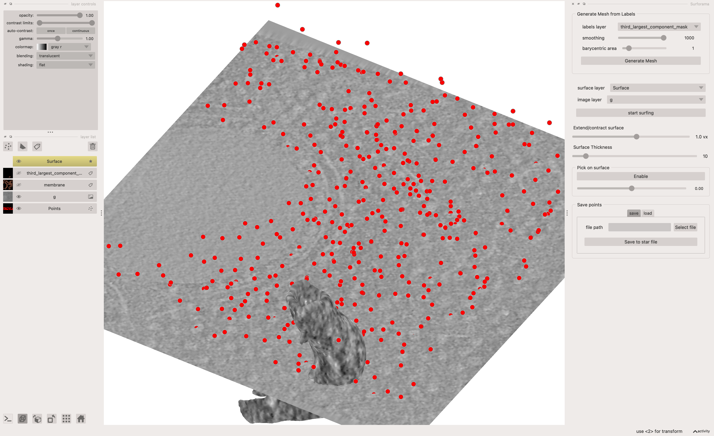

# Loading data from the [CZ cryoET Data Portal](https://cryoetdataportal.czscience.com/)

For this code to work you'll need to install `cryoet-data-portal` which you can do by following the installation instructions on [this site](https://chanzuckerberg.github.io/cryoet-data-portal/).



## Script

This script will:

- load a tomogram, membrane annotation, and points from the cryoET data portal
- run connected components and return the 3rd largest component (in this dataset the large membranes can be slow for `surforama`)
- open the Surforama widget


Once that has happened there are some interactive steps:

- select the layer for the 3rd largest component in `surforama`
- run `Generate Mesh`
- run `start surfing`
- explore the surface of this section of membrane


```python
import cryoet_data_portal as portal
import zarr
import napari
import s3fs
import ndjson
import numpy as np
import scipy.ndimage as ndi
from skimage import measure
import surforama

# Instantiate a client, using the data portal GraphQL API by default
client = portal.Client()

fs = s3fs.S3FileSystem(anon=True)

# Use the find method to select datasets that contain membrane annotations
datasets = portal.Dataset.find(client, [portal.Dataset.runs.tomogram_voxel_spacings.annotations.object_name.ilike("%membrane%")])
dataset_id = datasets[0].id

# An example Tomogram
tomo = portal.Tomogram.find(client, [portal.Tomogram.tomogram_voxel_spacing.run.dataset_id == dataset_id])[0]
run_id = tomo.tomogram_voxel_spacing.run.id

# Show downscaled tomogram
g = zarr.open_array(f"{tomo.https_omezarr_dir}/2", mode='r')

# Annotations
annotations = tomo.tomogram_voxel_spacing.annotations

# Ribosomes
ribosomes_a = annotations[0]
ribosome_name = ribosomes_a.object_name
ribosomes = []
with fs.open(ribosomes_a.files[0].s3_path) as pointfile:
    for point in ndjson.reader(pointfile):
        ribosomes.append((point['location']['z'], point['location']['y'], point['location']['x']))

# Membrane
membrane_a = annotations[1]
membrane_name = membrane_a.object_name
membrane_path = membrane_a.files[0].https_path
membrane = zarr.open_array(f"{membrane_path}/2")

# Run connected components on the membrane data
labeled_membrane, num_features = ndi.label(membrane)
sizes = np.bincount(labeled_membrane.ravel())

# Exclude background (label 0) and sort the component sizes in descending order
# Get the labels sorted in reverse by component size (excluding background)
sorted_labels = np.argsort(sizes[1:])[::-1] + 1

# Get the label of the 3rd largest component so we don't have a large mesh
third_largest_label = sorted_labels[2]

# Create a mask
third_largest_component_mask = labeled_membrane == third_largest_label

# Load into Surforama and Napari
viewer = napari.Viewer(ndisplay=3)

# Add tomogram, ribosomes, and membrane data to the viewer
viewer.add_points(ribosomes, face_color="red")
viewer.add_image(g, scale=(4, 4, 4))
viewer.add_labels(membrane, scale=(4, 4, 4))
viewer.add_labels(third_largest_component_mask, scale=(4, 4, 4))

# may need to use viewer.layers[-1].scale = (4, 4, 4)

# Instantiate the Surforama widget
surforama_widget = surforama.QtSurforama(viewer)
viewer.window.add_dock_widget(surforama_widget, area="right", name="Surforama")

napari.run()
```